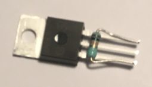

# GPS module

Cheap GPS module can be found on ebay or aliexpress. Some of these module even include an antenna, although it is not mentioned whether these are active or passive. (Given the price the latter is to be expected)

## Power consumption

GPS modules consume about 60-80 milli amps. That might not sound like a lot, but for a node running on batteries or USB power banks with capacities of 1200 mAh to 21000 mAh this means a maximum run time of 20 to 350 hours.

To reduce, or at least be able to reduce, the power consumption the power feed to the GPS module will be switchable using a MOSFET.

We will start with the assembly of the switching circuit.

## MOSFET circuit

Place the mosfet with the metal plate on the bottom on something resistant to heat. Get the 10K resistor (brown-black-orange), bend the wires like the picture below and trim them.

Use a clothing pin or crocodile clamp to clamp the resistor to the mosfet

Use a soldering iron to solder the resistor wires to the mosfet

NOTE: in these instructions wires of different colors are used. This is not required, but makes it easier to find what needs to be connected to what.

NOTE: After soldering a wire (and checking it is solidly connected) always trim the wire ends.

Get 10cm of orange wire. Strip 1,5 cm of the the isolation of one end and twist it round the middle pin of the mosfet. Use solder to fix it.

Use 1,5 cm of heat shrink tube to protect the connection you just made. Push the tube up to the housing of the mosfet if possible.

Take two 10 cm red wires, strip 1,5 cm of the isolation on one side and twist them together. Now wrap this around the upper pin (pins at the right of the mosfet) and fix with solder.

Push a piece of heat shrink over the connection.

Now take the 1K resistor (brown-black-red) and wrap it around the remaining (unconnected) pin. Trim the wire as in the picture below, fix the resistor to the mosfet. Trim the second wire of the resistor to about 1 cm. Take 10 cm of white wire, strip 1,5 cm of one end and twist it around the second wire of the 1K resistor and solder it in place.

Use 2,5 cm of heat shrink tube to protect the connections and the resistor.

Use a 3 cm piece of 9 mm diameter heat shrink tube to protect the mosfet, this is required because the mosfet metal plate is connected to the middle pin.

Use a heat gun at the appropriate temperature to shrink all heat shrink tubes.

## Modifying the GPS board

The GPS board has a small battery fitted. Looking at the specifications of the (alleged) manufacturer of the modules the voltage provided by the battery is insufficient. We're going to remove the battery to allow fitting a wire to connect to a better power source.

Place the GPS board on a flat surface like the picture below.

NOTE: the PCB trace at the top of the battery pointed at by the metal pointer is fragile and must not be damaged!

Use a sharp and sturdy object to lift the battery by inserting it at the side of the hole. This will disconnect the PCB trace at that side from the PCB. STOP once the battery is disconnected at that side to avoid damaging the other trace.

Now use a soldering iron to loosen the battery at the point indicated by the pointer in the picture above.

Take one of the red wires attached to the mosfet, strip 1 cm of the isolation. Add tin using the soldering iron and attach to the trace where you just removed the battery connector. (Trim excess wire)

Strip 1 cm of the orange wire, insert in the left hole (the one furthest away from the hole with square pad) and solder.

Get a black, yellow and purple wire, strip 1cm isolation and connect to the GPS module as shown, note the picture below has the PCB the other way around. (The result should be orange-black-yellow-purple)

## Connecting everything together

If you want to power the node using external batteries you need two additional wires.

Strip 1 cm of the isolation of all the remaining wires connected to the mosfet and those connected to the GPS module.

Connect the purple wire to the hole marked 1 of the lora32u4. Connect the yellow one to 0. Connect the white wire to 10.

Connect the red wire to 3V3.

If you want to use external power (not connected to the JST connector), twist the black wire with the end of a new wire and connect to GND.

If you want to use external power connect the power input to BAT (next to the JST connector)

The result should look like the picture below (green wire is ground for external power and the second yellow wire is voltage in)

[Next we'll test the GPS module and connections.](gps-node.md)