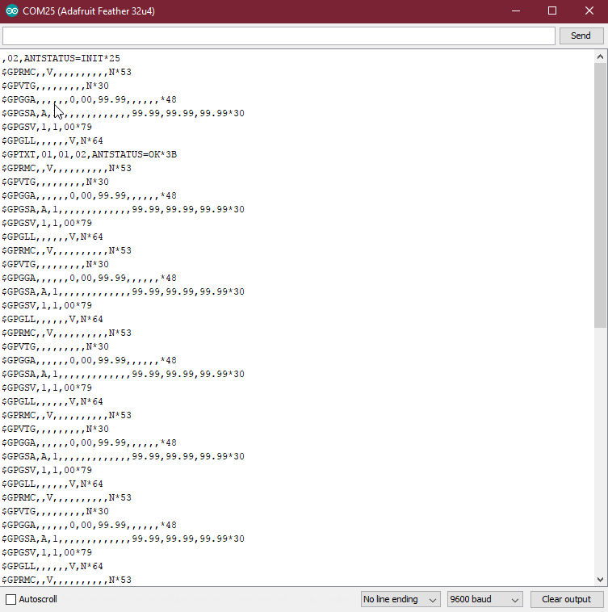
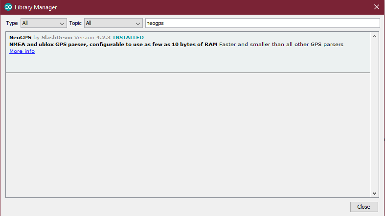

# Testing the GPS module

To check if everything is wired a expected we will install a simple loopback sketch. It will read the output of the GPS module and feed it back to the USB connected computer.

```
#define GPSPowerPin 10

void setup() {
  // put your setup code here, to run once:
  Serial1.begin(9600);
  delay(5000);

  pinMode(GPSPowerPin,OUTPUT);
  digitalWrite(GPSPowerPin,LOW);
  Serial.print("Starting loopback of Serial ports\n");
}

int b = 0;

void loop() {
  // put your main code here, to run repeatedly:
  if (Serial1.available() > 0) {
     b = Serial1.read();
     Serial.write(b);
  }
  if (Serial.available() > 0) {
     b = Serial.read();
     Serial1.write(b);
  }

}
```
(loop-serial in the archive)

Compile the code and transfer it to the lora32u4 by pressing the arrow icon. Once the upload is completed open the serial monitor to observe the output.

The red LED on the GPS module should light up 5 seconds after the software started. In the serial monitor you should see NMEA messages.



# Installation of the GPS library

The GPS module provides NMEA output, to conveniently get the coordinates from these messages we will use a library. Install it like we installed the LMIC library, go to Sketch, Include Library, Manage Libraries and search for neoGPS and install it.



# Basic GPS tracker software

Now all hardware is available and the required software has been installed we can build our basic GPS tracker software.

```


/*******************************************************************************
   Copyright (c) 2015 Thomas Telkamp and Matthijs Kooijman

   Permission is hereby granted, free of charge, to anyone
   obtaining a copy of this document and accompanying files,
   to do whatever they want with them without any restriction,
   including, but not limited to, copying, modification and redistribution.
   NO WARRANTY OF ANY KIND IS PROVIDED.

   This example will send Temperature and Humidity
   using frequency and encryption settings matching those of
   the The Things Network. Application will 'sleep' 7x8 seconds (56 seconds)

   This uses OTAA (Over-the-air activation), where where a DevEUI and
   application key is configured, which are used in an over-the-air
   activation procedure where a DevAddr and session keys are
   assigned/generated for use with all further communication.

   Note: LoRaWAN per sub-band duty-cycle limitation is enforced (1% in
   g1, 0.1% in g2), but not the TTN fair usage policy (which is probably
   violated by this sketch when left running for longer)!

   To use this sketch, first register your application and device with
   the things network, to set or generate an AppEUI, DevEUI and AppKey.
   Multiple devices can use the same AppEUI, but each device has its own
   DevEUI and AppKey.

   Do not forget to define the radio type correctly in config.h.

 *******************************************************************************/

#include <avr/wdt.h>
#include <lmic.h>
#include <hal/hal.h>
#include <SPI.h>

#define NMEAGPS_FIX_MAX 1
#define NMEAGPS_KEEP_NEWEST_FIXES true

#include <NMEAGPS.h>

#include <Arduino.h>

bool joined = false;
bool sleeping = false;
unsigned long time;

#define LedPin 13
#define GPSPowerPin 10
#define VBATPIN A9

#define gpsPort Serial1
#define GPS_PORT_NAME "Serial1"
#define DEBUG_PORT Serial

//------------------------------------------------------------
// Check that the config files are set up properly

#if !defined( NMEAGPS_PARSE_RMC )
#error You must uncomment NMEAGPS_PARSE_RMC in NMEAGPS_cfg.h!
#endif

#if !defined( GPS_FIX_TIME )
#error You must uncomment GPS_FIX_TIME in GPSfix_cfg.h!
#endif

#if !defined( GPS_FIX_LOCATION )
#error You must uncomment GPS_FIX_LOCATION in GPSfix_cfg.h!
#endif

#if !defined( GPS_FIX_SPEED )
#error You must uncomment GPS_FIX_SPEED in GPSfix_cfg.h!
#endif

#if !defined( GPS_FIX_SATELLITES )
#error You must uncomment GPS_FIX_SATELLITES in GPSfix_cfg.h!
#endif

#ifdef NMEAGPS_INTERRUPT_PROCESSING
#error You must *NOT* define NMEAGPS_INTERRUPT_PROCESSING in NMEAGPS_cfg.h!
#endif

static NMEAGPS  gps;

// This EUI must be in little-endian format, so least-significant-byte
// first. When copying an EUI from ttnctl output, this means to reverse
// the bytes. For TTN issued EUIs the last bytes should be 0xD5, 0xB3,
// 0x70.

static const u1_t DEVEUI[8]  = { 0x00, 0x00, 0x00, 0x00, 0x00, 0x00, 0x00, 0x00 };
static const u1_t APPEUI[8] = { 0x00, 0x00, 0x00, 0x00, 0x00, 0x00, 0x00, 0x00 };

// This key should be in big endian format (or, since it is not really a
// number but a block of memory, endianness does not really apply). In
// practice, a key taken from ttnctl can be copied as-is.
// The key shown here is the semtech default key.
static const u1_t APPKEY[16] = { 0x00, 0x00, 0x00, 0x00, 0x00, 0x00, 0x00, 0x00, 0x00, 0x00, 0x00, 0x00, 0x00, 0x00, 0x00, 0x00 };

static void initfunc (osjob_t*);

int32_t lat;
int32_t lon;
int32_t alt;
bool fix;

// provide APPEUI (8 bytes, LSBF)
void os_getArtEui (u1_t* buf) {
  memcpy(buf, APPEUI, 8);
}

// provide DEVEUI (8 bytes, LSBF)
void os_getDevEui (u1_t* buf) {
  memcpy(buf, DEVEUI, 8);
}

// provide APPKEY key (16 bytes)
void os_getDevKey (u1_t* buf) {
  memcpy(buf, APPKEY, 16);
}

static osjob_t sendjob;
static osjob_t initjob;

// Pin mapping is hardware specific.
// Pin mapping
const lmic_pinmap lmic_pins = {
  .nss = 8,
  .rxtx = LMIC_UNUSED_PIN,
  .rst = 1, // Needed on RFM92/RFM95? (probably not) D0/GPIO16
  .dio = {7, 6, LMIC_UNUSED_PIN}, // Specify pin numbers for DIO0, 1, 2
  // connected to D7, D6, -
};

void onEvent (ev_t ev) {
  int i, j;
  switch (ev) {
    case EV_SCAN_TIMEOUT:
      Serial.println(F("EV_SCAN_TIMEOUT"));
      break;
    case EV_BEACON_FOUND:
      Serial.println(F("EV_BEACON_FOUND"));
      break;
    case EV_BEACON_MISSED:
      Serial.println(F("EV_BEACON_MISSED"));
      break;
    case EV_BEACON_TRACKED:
      Serial.println(F("EV_BEACON_TRACKED"));
      break;
    case EV_JOINING:
      Serial.println(F("EV_JOINING"));
      break;
    case EV_JOINED:
      Serial.println(F("EV_JOINED"));
      // Disable link check validation (automatically enabled
      // during join, but not supported by TTN at this time).
      LMIC_setLinkCheckMode(0);
      digitalWrite(LedPin, LOW);
      // after Joining a job with the values will be sent.
      joined = true;
      break;
    case EV_RFU1:
      Serial.println(F("EV_RFU1"));
      break;
    case EV_JOIN_FAILED:
      Serial.println(F("EV_JOIN_FAILED"));
      break;
    case EV_REJOIN_FAILED:
      Serial.println(F("EV_REJOIN_FAILED"));
      // Re-init
      os_setCallback(&initjob, initfunc);
      break;
    case EV_TXCOMPLETE:
      sleeping = true;
      if (LMIC.dataLen) {
        // data received in rx slot after tx
        // if any data received, a LED will blink
        // this number of times, with a maximum of 10
        Serial.print(F("Data Received: "));
        Serial.println(LMIC.frame[LMIC.dataBeg], HEX);
        i = (LMIC.frame[LMIC.dataBeg]);
        // i (0..255) can be used as data for any other application
        // like controlling a relay, showing a display message etc.
        if (i > 10) {
          i = 10;   // maximum number of BLINKs
        }
        for (j = 0; j < i; j++)
        {
          digitalWrite(LedPin, HIGH);
          delay(200);
          digitalWrite(LedPin, LOW);
          delay(400);
        }
      }
      Serial.println(F("EV_TXCOMPLETE (includes waiting for RX windows)"));
      delay(50);  // delay to complete Serial Output before Sleeping

      // Schedule next transmission
      // next transmission will take place after next wake-up cycle in main loop
      break;
    case EV_LOST_TSYNC:
      Serial.println(F("EV_LOST_TSYNC"));
      break;
    case EV_RESET:
      Serial.println(F("EV_RESET"));
      break;
    case EV_RXCOMPLETE:
      // data received in ping slot
      Serial.println(F("EV_RXCOMPLETE"));
      break;
    case EV_LINK_DEAD:
      Serial.println(F("EV_LINK_DEAD"));
      break;
    case EV_LINK_ALIVE:
      Serial.println(F("EV_LINK_ALIVE"));
      break;
    default:
      Serial.println(F("Unknown event"));
      break;
  }
}

void do_send(osjob_t* j) {
  byte buffer[22];
  int32_t i;
  int32_t h;
  float measuredvbat = analogRead(VBATPIN);

  i = 0;

  if (fix) {
    buffer[i++] = 0x01;
    buffer[i++] = 0x88;
    h = lat / 1000L;
    buffer[i++] = (h >> 16) & 0xff;
    buffer[i++] = (h >> 8) & 0xff;
    buffer[i++] = h & 0xff;
    h = lon / 1000L;
    buffer[i++] = (h >> 16) & 0xff;
    buffer[i++] = (h >> 8) & 0xff;
    buffer[i++] = h & 0xff;
    buffer[i++] = (alt >> 16) & 0xff;
    buffer[i++] = (alt >> 8) & 0xff;
    buffer[i++] = alt & 0xff;
  }

  measuredvbat *= 2;    // we divided by 2, so multiply back
  measuredvbat *= 3.3;  // Multiply by 3.3V, our reference voltage
  measuredvbat /= 1024; // convert to voltage
  h = measuredvbat * 100;
  Serial.print("VBat: " ); Serial.println(h);
  buffer[i++] = 0x02;
  buffer[i++] = 0x02;
  buffer[i++] = (h >> 8) & 0xff;
  buffer[i++] = h & 0xff;

  if (LMIC.opmode & OP_TXRXPEND) {
    Serial.println(F("OP_TXRXPEND, not sending"));
  } else {
    // Prepare upstream data transmission at the next possible time.
    LMIC_setTxData2(1, (uint8_t*) buffer, i , 0);
    Serial.println(F("Sending"));
  }
}

// initial job
static void initfunc (osjob_t* j) {
  // reset MAC state
  LMIC_reset();
  LMIC_setClockError(MAX_CLOCK_ERROR * 1 / 100);
  // start joining
  LMIC_startJoining();
  // init done - onEvent() callback will be invoked...
}

void setup()
{
  // Disable GPS power
  digitalWrite(GPSPowerPin, HIGH);
  delay(10000);
  Serial.begin(9600);
  Serial.println(F("Starting"));
  delay(10000);
  fix = false;
  os_init();
  // Reset the MAC state. Session and pending data transfers will be discarded.
  os_setCallback(&initjob, initfunc);
  LMIC_reset();

  pinMode(GPSPowerPin, OUTPUT);
  digitalWrite(GPSPowerPin, LOW);

  gpsPort.begin(9600);
  time = millis();
}

static void doSomeWork( const gps_fix & cfix )
{
  if (cfix.valid.location) {
    Serial.println(F("GPS fix"));
    lat = cfix.latitudeL();
    lon = cfix.longitudeL();
    alt = cfix.altitude_cm();
    fix = true;
  } else {
    Serial.println(F("GPS no fix"));
    fix = false;
  }
} // doSomeWork

void loop()
{
  while (gps.available( gpsPort ))
    doSomeWork( gps.read() );

  // start OTAA JOIN
  if (joined == false)
  {
    os_runloop_once();
  } 
  else 
  {
    if (millis() - time >= 3000) {
      do_send(&sendjob);    // Send sensor values
      while (sleeping == false)
      {
        os_runloop_once();
      }
      sleeping = false;
      delay(120000);
      time = millis();
    }
  }

  digitalWrite(LedPin, ((millis() / 100) % 2) && (joined == false));
}

```

Do not forget to change the values of:

- DEVEUI
- APPEUI
- APPKEY


The above code is just an example, several improvements can be made to conserve power:

1. use power saving wait in stead of delay for 120 seconds (possible options are low power lib or Adafruit SleepyDog Library)
1. send data less frequently, for instance every 15 minutes or even once every hour
1. disable the gps module while waiting for the next transmission slot

Finally we want to [visualize our position](visualize.md)

## BONUS Get the low power library

1. Goto [https://github.com/rocketscream/Low-Power](https://github.com/rocketscream/Low-Power)
1. Choose 'Clone or download'
1. Download ZIP (again, remember the location you save the file)
1. In the Arduino IDE select 'Sketch', 'Include Library' and select 'Add .ZIP library' in the sub menu.
1. Browse to the file you just downloaded and open it

## BONUS Get Adafruit Sleepy Dog Library

1. Goto [https://github.com/adafruit/Adafruit_SleepyDog](https://github.com/adafruit/Adafruit_SleepyDog)
1. Choose 'Clone or download'
1. Download ZIP (again, remember the location you save the file)
1. In the Arduino IDE select 'Sketch', 'Include Library' and select 'Add .ZIP library' in the sub menu.
1. Browse to the file you just downloaded and open it
