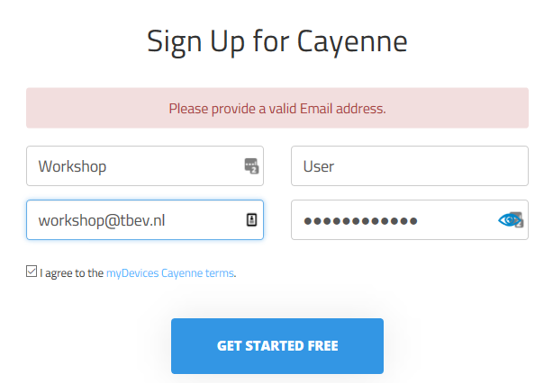
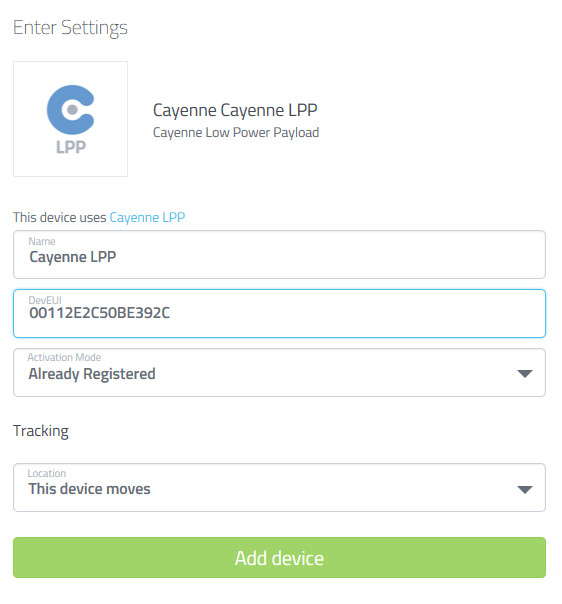

# Visualizing the position data

For this workshop we will use Cayenne to visualize the position data. 

Start by creating a Cayenne account.

## Cayenne account

Open your [www.mydevices.com](http://www.mydevices.com/), click on the 'SIGN IP FREE' button in right top of the site.

Fill out the form and review the terms!

Choose "All devices" (NOT "LoRa"!!)

Next scroll down and select "The Things Network" in the LoRa category.

Find "Cayenne LPP" in the list and select it.

Now you need the devive EUI from the TTN console. In the TTN console go to your application, go to devices and select the device. Copy the Device EUI.

On the Cayenne website add the device EUI to the form, keep the other settings as default and 'Add device'.

The Cayenne setup is complete.

## Configure TTN to forward data

The next step is to setup TTN to forward this nodes data to Cayenne. For this we need to use the data integrations.

In the TTN console browse to your application. Select 'Integrations' from the tabs.

Select "+ add integration".

Select "Cayenne"

In the next form you need to enter the Process ID. Switch back to you cayenne browser window and select the part of the URL after ...lora/

Enter this value on the form at the process id. For the access key select 'default key' from the menu.

Press the 'Add integration' button at the bottom of the form. This should refresh the screen. The new screen should show 'Status: running'.

Go to Cayenne, if your node is transmitting data after a few minutes your screen should update to show measurements.

Once the GPS has a fix its data should be visible on Cayenne as well.

Cayenne has allows you to create custom views where you can change the layout and formatting of your values. Start by clicking on "+Create new project", provide a project name and start experimenting.

THE END